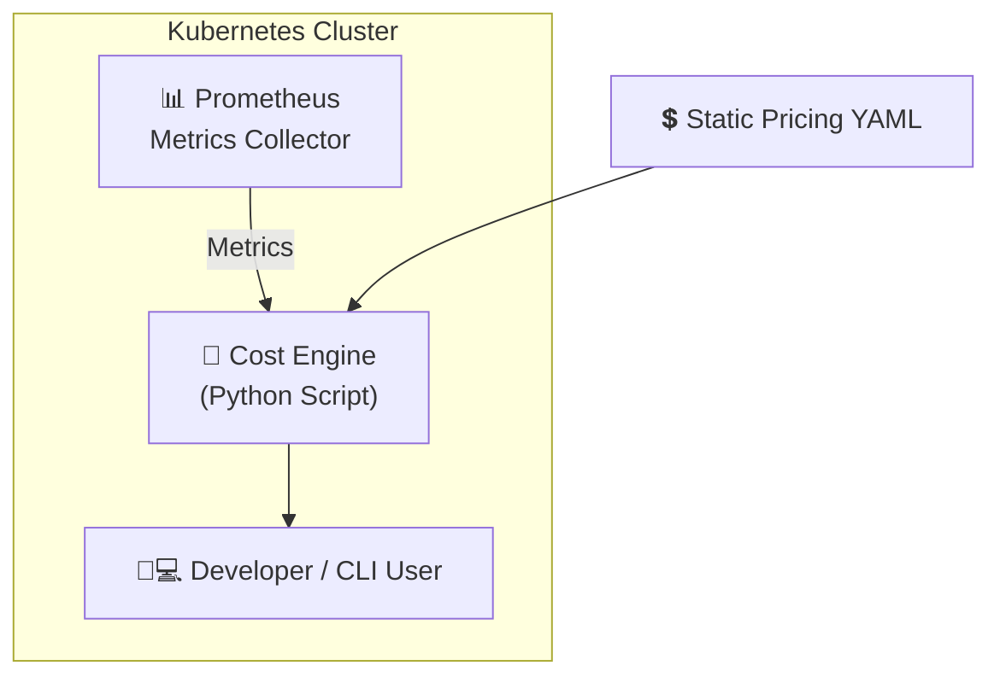
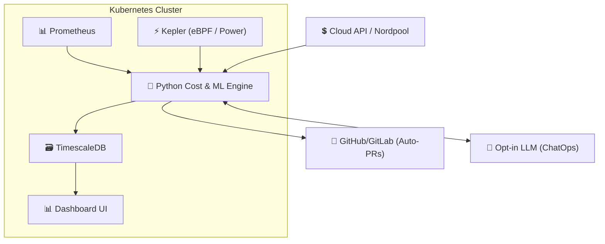

# k8s-cost 💸
# 🔍 Next-Gen Kubernetes Cost & Carbon Optimization

A flexible, open-source solution for tracking, predicting, and optimizing Kubernetes costs across cloud, hybrid, and on-prem environments. 

**k8s-cost** goes beyond traditional "read-only" dashboards like Kubecost and OpenCost. We focus on **Actionable FinOps**, **GreenOps**, and **GitOps automation**.

---

## 🌟 Vision: Why k8s-cost?

Traditional cost tools give you *dashboard fatigue*. They tell you you're wasting money, but leave the fixing to you. They also consume massive amounts of Prometheus memory for high-cardinality metrics.

**k8s-cost is built to be different:**

1. **GitOps FinOps (Auto-Remediation):** Don't just show wasted CPU. Automatically generate GitHub/GitLab Pull Requests to rightsize your `deployment.yaml` or Helm values.
2. **GreenOps via eBPF (Kepler):** Track not just dollars, but Watts and CO2 emissions using eBPF, helping organizations comply with CSRD and ESG sustainability goals.
3. **Agentic AI (Opt-in):** Ask "Why did my cost jump 30% yesterday?" and get plain-English answers using local or cloud LLMs analyzing events and billing drift.
4. **First-Class Bare-Metal Support:** Build complex on-prem pricing models, including hardware depreciation and real-time electricity spot prices (e.g., Nordpool integration).

---

## 🛠️ Key Technologies

- **Prometheus & Kepler (eBPF)** – metrics and power consumption collection
- **Python / FastAPI** – high-performance cost attribution engine
- **Next.js / Streamlit** – modern, responsive dashboards
- **TimescaleDB** – highly efficient historical data storage
- **GitOps Integrations** – direct links to GitHub/GitLab APIs for Auto-PRs
- **Opt-in LLM Engine** – ChatOps cost explanations

---
## Architecture

### MVP Phase (Current)


```mermaid
flowchart TD
    subgraph Kubernetes Cluster
        Prometheus["📊 Prometheus<br>Metrics Collector"]
        PythonEngine["🧮 Cost Engine<br>(Python Script)"]
        Dev["👩💻 Developer / CLI User"]
    end

    Pricing["💲 Static Pricing YAML"]

    Prometheus -->|Metrics| PythonEngine
    Pricing --> PythonEngine
    PythonEngine --> Dev
```

### Next-Gen Architecture (v2.0)


```mermaid
flowchart TD
    subgraph Kubernetes Cluster
        Prometheus["📊 Prometheus"]
        Kepler["⚡ Kepler (eBPF / Power)"]
        CostEngine["🧮 Python Cost & ML Engine"]
        NextJS["📊 Dashboard UI"]
        Timescale["🗃️ TimescaleDB"]
    end

    Git["🐙 GitHub/GitLab (Auto-PRs)"]
    LLM["🤖 Opt-in LLM (ChatOps)"]
    Pricing["💲 Cloud API / Nordpool"]

    Prometheus --> CostEngine
    Kepler --> CostEngine
    Pricing --> CostEngine
    CostEngine --> Timescale
    CostEngine --> Git
    CostEngine <--> LLM
    Timescale --> NextJS
```

---

## 🚀 Development Roadmap

| Stage | Features | Goal |
|-------|----------|------|
| ✅ **Stage 1 – MVP** | Basic CPU & memory cost attribution | Prove core logic |
| 🔄 **Stage 2 – Dashboards** | Add visual exploration interface | Make data easily explorable |
| 🔄 **Stage 3 – GreenOps & eBPF** | Integrate Kepler for Watt/CO2 tracking | Add sustainability tracking |
| 🔄 **Stage 4 – GitOps Auto-PRs** | Automated Pull Requests for rightsizing | Move from observation to action |
| 🔄 **Stage 5 – Agentic AI** | Opt-in LLM cost explainer chat | Democratize FinOps data |
| 🔄 **Stage 6 – Advanced On-Prem** | Hardware depreciation & power spot pricing | Perfect hybrid/bare-metal support |

---

## 📁 Project Structure

```bash
k8s-cost/
├── charts/                  # Helm chart for deploying the stack
├── dashboard/               # UI components
├── docs/                    # Architecture diagrams, setup guides
├── scripts/                 # Python scripts for cost attribution
│   └── cost_calculator.py
├── pricing/                 # Pricing configs (AWS/GCP/Static/Power)
├── queries/                 # PromQL/Timescale queries
├── db/                      # PostgreSQL/TimescaleDB schema
└── README.md
```

## ✅ Compatibility

This solution is designed to work with all major Kubernetes distributions, prioritizing **upstream Kubernetes** and **Bare-Metal environments**. It runs fully air-gapped by default, transmitting no external data unless specifically configured to use Cloud Billing APIs or Opt-in LLMs.

---

## 🔒 Security & Privacy

This solution is designed for self-hosted use and **does not transmit any data externally** by default.

- ✅ No data sent to third-party APIs (unless cloud pricing or opt-in LLMs are enabled)
- ✅ Fully compatible with air-gapped environments
- 🔐 Secure API using standard Kubernetes RBAC

## 💬 Community & Support

Have questions, ideas, or feedback?

- 📂 [File an issue](https://github.com/egkristi/k8s-cost/issues)
- 🤝 Contribute by opening a PR!
- 🔒 For security issues, please email: egkristi@gmail.com
