# k8s-cost
# 🔍 Kubernetes Cost Monitoring & Optimization

A flexible, open-source solution for tracking and optimizing Kubernetes costs across cloud, hybrid, and on-prem environments. Built with Prometheus, Python, and optional UIs like Streamlit or Grafana.

---

## 🌟 Vision

This project aims to create a **transparent, customizable, and vendor-agnostic alternative to Kubecost**, enabling organizations to:

- Track real-time resource usage and cost at pod, namespace, or label level
- Integrate actual cloud pricing or on-prem cost models
- Visualize trends, anomalies, and opportunities for cost savings
- Deploy in cloud, hybrid, or air-gapped environments

---

## 🛠️ Key Technologies

- **Prometheus** – metrics collection and querying
- **Python** – cost attribution engine
- **Streamlit / Grafana** – dashboards and UI
- **TimescaleDB / PostgreSQL (optional)** – historical data storage
- **Kubernetes** – native deployment via Helm/Operators
- **Cloud APIs or static pricing** – flexible pricing models

---
## Architecture

### MVP phase solution

```mermaid
flowchart TD
    subgraph Kubernetes Cluster
        Prometheus["📊 Prometheus<br>Metrics Collector"]
        PythonEngine["🧮 Cost Engine<br>(Python Script)"]
        Dev["👩‍💻 Developer / CLI User"]
    end

    Pricing["💲 Static Pricing YAML"]

    Prometheus -->|Metrics| PythonEngine
    Pricing --> PythonEngine
    PythonEngine --> Dev
```



### Single Cluster Architecture

```mermaid
flowchart TD
    subgraph Kubernetes Cluster
        Prometheus["📊 Prometheus"]
        KSM["📦 kube-state-metrics"]
        NodeExporter["🖥️ node-exporter"]
        CostEngine["🧮 Python Cost Engine"]
        Streamlit["📊 Streamlit App"]
        Grafana["📈 Grafana (Optional)"]
        Timescale["🗃️ TimescaleDB (Optional)"]
    end

    Pricing["💲 Static or Cloud Pricing"]
    User["👩‍💻 User / Ops"]

    Prometheus --> CostEngine
    KSM --> Prometheus
    NodeExporter --> Prometheus
    Pricing --> CostEngine
    CostEngine --> Streamlit
    CostEngine --> Timescale
    Timescale --> Grafana
    Streamlit --> User
    Grafana --> User
```



### Full Cloud-Aware & Multi-Cluster Architecture

```mermaid
flowchart TB
    subgraph ClusterA["Kubernetes Cluster A"]
        PrometheusA["📊 Prometheus A"]
        CostEngineA["🧮 Cost Engine A"]
        KSM_A["kube-state-metrics"]
    end

    subgraph ClusterB["Kubernetes Cluster B"]
        PrometheusB["📊 Prometheus B"]
        CostEngineB["🧮 Cost Engine B"]
        KSM_B["kube-state-metrics"]
    end

    CloudPricing["☁️ Cloud Billing API"]
    StaticPricing["💲 Static Pricing Config"]
    CentralDB["🗃️ Central TimescaleDB"]
    Grafana["📈 Grafana Dashboard"]
    Slack["🔔 Alerts / Reports"]
    Admin["👤 Admin / Ops"]

    PrometheusA --> CostEngineA
    PrometheusB --> CostEngineB
    KSM_A --> PrometheusA
    KSM_B --> PrometheusB

    CloudPricing --> CostEngineA
    CloudPricing --> CostEngineB
    StaticPricing --> CostEngineA
    StaticPricing --> CostEngineB

    CostEngineA --> CentralDB
    CostEngineB --> CentralDB
    CentralDB --> Grafana
    Grafana --> Admin
    CostEngineA --> Slack
    CostEngineB --> Slack
```


---

## 🚀 Development Roadmap

| Stage | Features | Goal |
|-------|----------|------|
| ✅ **Stage 1 – MVP** | Basic CPU & memory cost attribution using Prometheus + Python CLI | Prove core logic and metrics integration |
| 🔄 **Stage 2 – Visual Dashboards** | Add Streamlit and/or Grafana support | Make data easily explorable |
| 🔄 **Stage 3 – Historical Tracking** | Store cost data in TimescaleDB or Prometheus TSDB | Enable trending and forecasting |
| 🔄 **Stage 4 – Cloud Cost Integration** | Fetch dynamic prices from AWS/GCP/Azure or custom YAML | Match usage to real-world costs |
| 🔄 **Stage 5 – Reporting & Alerting** | Slack/email reports, alerts for anomalies | Operationalize insights |
| 🔄 **Stage 6 – Advanced Attribution** | Include GPU, storage, egress, and shared cost splits | Full-stack cost insight |
| 🔄 **Stage 7 – Enterprise Features** | Multi-cluster support, RBAC, usage quotas | Production-ready adoption |

---

## 📁 Project Structure

```bash
k8s-cost-monitor/
├── charts/                  # Helm chart for deploying the stack
├── dashboard/               # Streamlit/Grafana dashboards
├── docs/                    # Architecture diagrams, setup guides
├── scripts/                 # Python scripts for cost attribution
│   └── cost_calculator.py
├── pricing/
│   └── aws_pricing.yaml     # Static or fetched pricing data
├── queries/
│   └── prometheus_queries/  # Saved PromQL queries
├── db/                      # PostgreSQL/TimescaleDB schema (if used)
├── .env.example             # Environment variable template
├── requirements.txt         # Python dependencies
├── Dockerfile               # Python app Docker container
└── README.md

## ✅ Compatibility

This solution is designed to work with all major Kubernetes distributions and environments, with a primary focus on **upstream Kubernetes**.

### 🎯 Target Compatibility

| Platform                        | Status     | Notes |
|---------------------------------|------------|-------|
| **Upstream Kubernetes**         | ✅ Full     | Core reference platform (v1.22+) |
| **GKE (Google Kubernetes Engine)** | ✅ Full     | Works with GKE Autopilot and Standard |
| **EKS (Amazon Elastic Kubernetes Service)** | ✅ Full     | Includes support for spot instances, Fargate (partial) |
| **AKS (Azure Kubernetes Service)** | ✅ Full     | Compatible with managed and self-managed nodes |
| **OpenShift**                   | ⚠️ Partial  | Works with Prometheus operator installed, requires `kube-state-metrics` access |
| **Rancher**                     | ✅ Full     | Tested with RKE2 and K3s setups |
| **K3s / Lightweight Clusters**  | ✅ Full     | Minimal Prometheus setup supported |
| **VMware Tanzu / vSphere with Tanzu** | ⚠️ Partial  | Needs custom node labels and metrics mapping |
| **Kubernetes on Bare Metal / On-Prem** | ✅ Full     | Supports static pricing models for offline use |

### 🧪 Requirements for Compatibility

- Prometheus instance scraping:
  - `container_cpu_usage_seconds_total`
  - `container_memory_usage_bytes`
  - `kube_pod_info`, `kube_namespace_labels` (from `kube-state-metrics`)
- Label-based cost attribution (requires common metadata availability)
- Access to node/pod metadata (via `kube-state-metrics` or direct API)

### 📦 Optional Add-Ons for Better Compatibility

- `kube-state-metrics` – Required for accurate namespace/deployment attribution
- `node-exporter` – For additional system-level resource tracking
- Cloud-specific metadata annotations (optional) to improve cost accuracy

> 💡 The architecture is intentionally decoupled from any specific cloud provider to maintain compatibility with hybrid, private, and disconnected Kubernetes environments.

## 🖥️ Bare-Metal & Platform Support

This project is built with full support for **bare-metal Kubernetes deployments**, ensuring it operates effectively in environments without native cloud integration, including private data centers, edge clusters, and air-gapped environments.

### ✅ Supported Bare-Metal Platforms

| Platform / Vendor               | Status     | Notes |
|---------------------------------|------------|-------|
| **Upstream Kubernetes (kubeadm)** | ✅ Full     | Primary supported deployment method |
| **Rancher RKE / RKE2**          | ✅ Full     | Compatible via Prometheus stack and K3s/RKE metrics |
| **K3s (Lightweight Kubernetes)**| ✅ Full     | Minimal setup; metrics scraping works out of the box |
| **VMware vSphere / ESXi**       | ✅ Full     | Supports static pricing or vCenter API integration (future) |
| **Proxmox VE**                  | ✅ Full     | Works with kubeadm or Rancher-based deployments |
| **OpenStack Private Cloud**     | ✅ Full     | Supports integration with static instance pricing |
| **Metal³ / Bare Metal Operator**| ✅ Full     | Compatible with upstream Kubernetes and CR-based node tracking |
| **Canonical MAAS + Kubernetes** | ✅ Full     | Supports monitoring with Prometheus and kube-state-metrics |
| **Supermicro / Dell / HPE Nodes** | ✅ Hardware agnostic | Works as long as Kubernetes is running with supported exporters |
| **Intel NUC / Edge Devices**    | ✅ Full     | Compatible with lightweight or edge-focused Kubernetes stacks (e.g., K3s) |

---

### 🧩 Key Features for Bare-Metal Use Cases

- 📴 **Air-Gapped Operation**: Static pricing models for CPU, memory, storage, and GPU — no need for cloud APIs
- 🧾 **Manual or automated pricing profiles**: Define pricing per node type, rack, or hardware profile using YAML or labels
- 🧠 **Works without node autoscalers or cloud APIs**: No dependency on cloud-specific services
- 📈 **Supports infrastructure labeling**: Add labels like `vendor=supermicro`, `cpu=intel`, `region=onprem` to map costs

---

### 💡 Example Static Pricing Configuration

```yaml
pricing:
  default:
    cpu_per_hour: 0.018   # Local estimate for on-prem vCPU
    memory_per_hour: 0.0027  # $/GiB/hour
    storage_per_gb_hour: 0.00011
  overrides:
    nodeSelector:
      "vendor": "dell"
    cpu_per_hour: 0.021
    memory_per_hour: 0.0031

---

## 🧪 Testing & Validation

To ensure cost calculations and integrations behave as expected:

1. Run local tests:
```bash
pytest tests/
```

Validate Prometheus integration:
```bash
python scripts/cost_calculator.py --prometheus-url=http://localhost:9090

---

## 🔄 Versioning & Releases

This project follows [Semantic Versioning (SemVer)](https://semver.org/).

- **MAJOR**: Breaking changes
- **MINOR**: New features, backward compatible
- **PATCH**: Bug fixes and minor improvements

Releases are tagged in GitHub and published under [Releases](https://github.com/egkristi/k8s-cost/releases).

---

## 🔒 Security & Privacy

This solution is designed for self-hosted use and **does not transmit any data externally** by default. All cost attribution logic and metric scraping happens within your cluster.

- ✅ No data sent to third-party APIs (unless cloud pricing APIs are explicitly configured)
- ✅ Compatible with air-gapped environments
- 🔐 Secure Prometheus and dashboards using Kubernetes RBAC and Ingress authentication
- 🛡️ Follow the [CIS Kubernetes Benchmark](https://www.cisecurity.org/benchmark/kubernetes/) for cluster hardening


## 💬 Community & Support

Have questions, ideas, or feedback?

- 📂 [File an issue](https://github.com/egkristi/k8s-cost/issues)
- 🤝 [Contribute](#-contributing)
- 📧 Contact: opensource@yourdomain.com
- 🔒 For security issues, please email: egkristi@gmail.com (do not open public issues)
